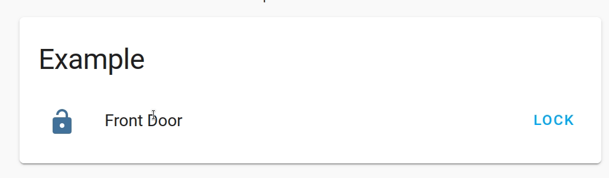

# onlylocklock

This is a custom entity row for locks in Home Assistant.  The intent is to expose the locks so that they can only be locked and not be unlocked through the ui.  This is good for wall tablets or for users with restricted access.

This entity row only allows the lock command to be called on a lock and prevents the more-info popup from being shown.  It looks like a normal lock row.
# Usage

Very simple and requires no extra configuration.  Add the type "custom:only-lock-lock-row" to your entity.

## Example
```yaml
entity: lock.front_door
type: custom:only-lock-lock-row
```

### Inside an Entities Card Configuration
```yaml
type: entities
entities:
- entity: lock.front_door
  type: custom:only-lock-lock-row
```



# Roadmap
In general, the intended purpose of this is complete, outside of maintenance/cleanup.  However, there are some optional features I want to add.
- Add battery level icon next to lock
  - Requires setting a battery sensor entity per lock.
- Allow specific user to unlock and view the more info popup.
- Support theming?